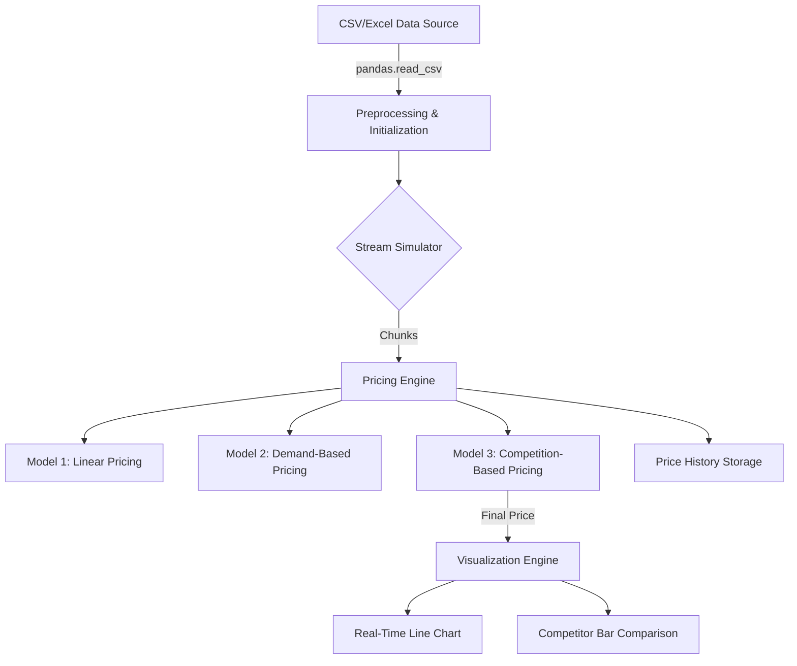

#  Dynamic Pricing for Urban Parking Lots

##  Overview

This project simulates and visualizes real-time dynamic pricing strategies for urban parking lots. It explores and compares three pricing models:

1. **Model 1: Linear Pricing**
2. **Model 2: Demand-Based Pricing**
3. **Model 3: Competition-Based Pricing**

The project uses historical parking data to simulate real-time price updates and helps visualize price behavior and competitor influence with interactive Bokeh plots.

---

##  Tech Stack

* **Python** (Pandas, NumPy, Geopy)
* **Bokeh** (for interactive real-time visualizations)
* **Jupyter Notebook** (for prototyping and live rendering)
* **IPython Display** (for `clear_output()` handling in notebooks)
* **Geopy** (to calculate distance between lots using latitude/longitude)

---

##  Architecture Diagram (Mermaid)



---

##  Project Architecture & Workflow

### 1. **Data Ingestion**

* Read static CSV containing historical data with columns like:

  * `SystemCodeNumber`, `Occupancy`, `Capacity`, `Latitude`, `Longitude`, etc.

### 2. **Stream Simulation**

* A `stream_data(df, chunk_size)` generator yields small chunks from the full dataset.
* Uses `time.sleep(1)` to simulate a real-time stream.

### 3. **Model Calculations**

* **Model 1**: Simple linear adjustment based on occupancy/capacity ratio.
* **Model 2**: Multi-factor demand model (uses queue length, special day, traffic, etc.).
* **Model 3**: Adjusts price based on average occupancy of nearby parking lots (geo proximity).

### 4. **Price History Storage**

* Prices from all 3 models are stored separately for optional comparison.
* Model 3 is used as the final real-time model for visualizations.

### 5. **Visualization**

* `update_and_plot()` shows a real-time line graph of prices per lot.
* `plot_competitor_comparison()` shows a bar chart comparing the price of a selected lot with its neighbors.

---

##  Additional Documentation

* `competition_price()`: Determines dynamic pricing using nearby lots.
* `compute_demand()`: Demand scoring based on various external and internal factors.
* `linear_price()`: Stateless linear model used as baseline.

---

---

##  Run Instructions

```bash
pip install pandas bokeh geopy
```

* Open the notebook (`.ipynb`)
* Replace dataset file path
* Run the notebook cells sequentially to simulate real-time pricing

---

## 📊 Example Output

* Dynamic pricing lines that update in-place every second
* Competitor comparisons updating with each chunk

---
